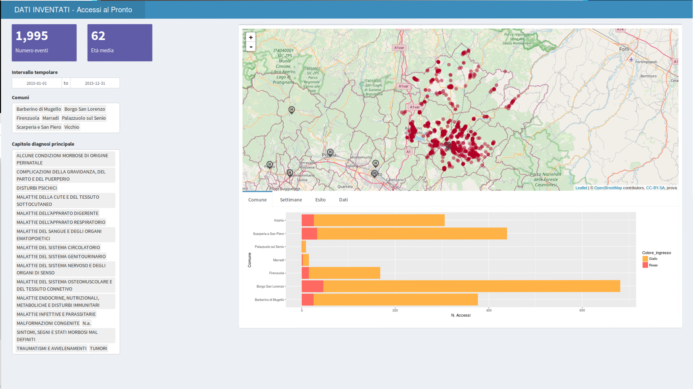

#RDashboardOSM

# Project Title

A RShiny Dashboard on OpenStreetMap in reactive way

## Getting Started

This a Rstudio Project using shinydashboard and leaftlet package to represent point on OpenStreetMap. The changing in input updating only the point thanks to the reactive way of programming. Loading the administrative border from a public WMS service from the Regional Toscany Authority and the Hospital point from a file only on the first loading page.

The map is accompained by graph, table and value box expression of detailed and aggregated data.

The data are **not real**, rearrange real data, **decoupling and randomizing** spatial coordinate to the classfication issue, representing the color of the Hospital access.

[Example on shiny.io](https://xpasdup.shinyapps.io/test1/)

### Prerequisites

R package used:

- shinydashboard
- leaflet
- ggplot2
- dplyr

## Authors

* **Omar Giorgetti** 
* **Walter Naldoni**

